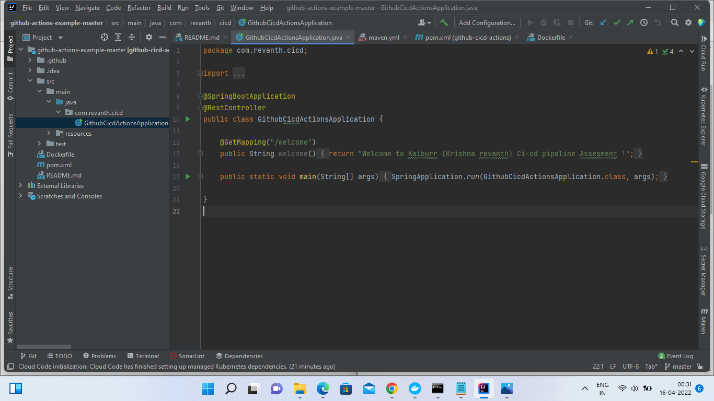
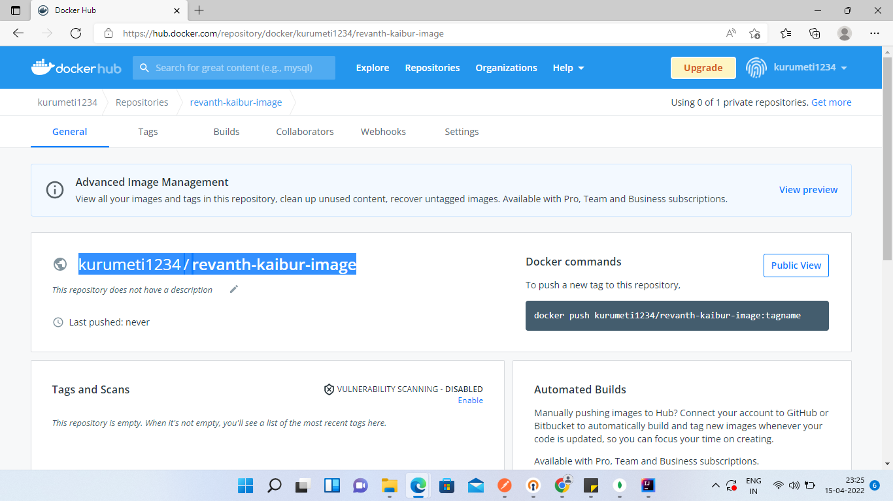
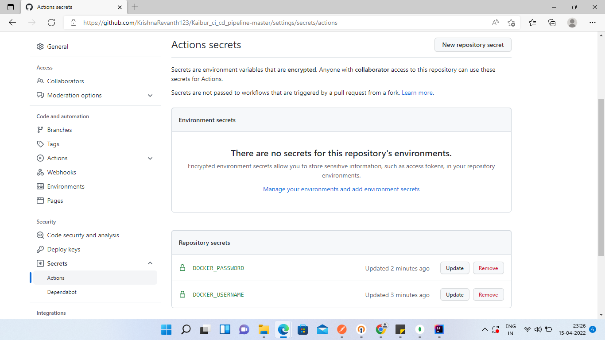
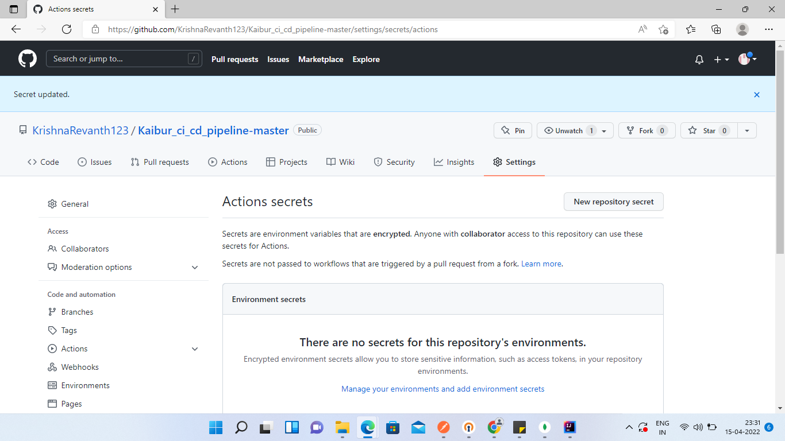
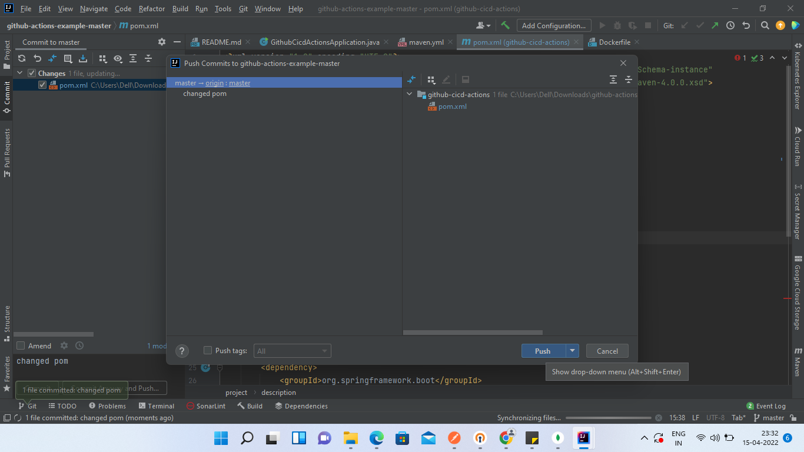
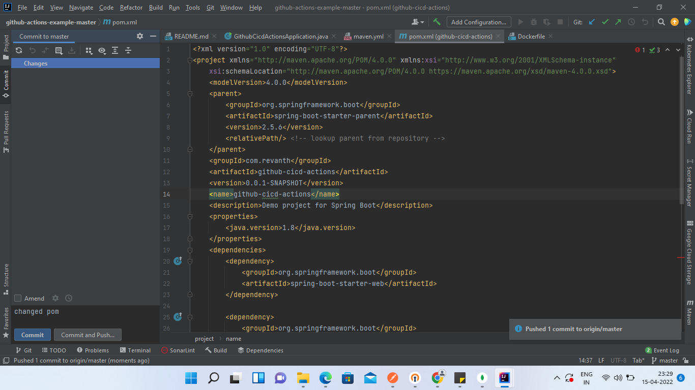
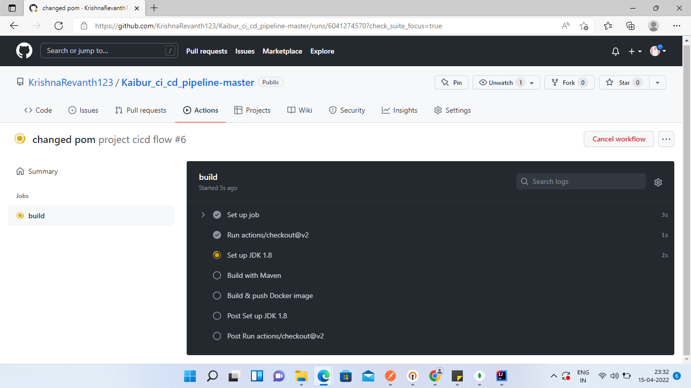
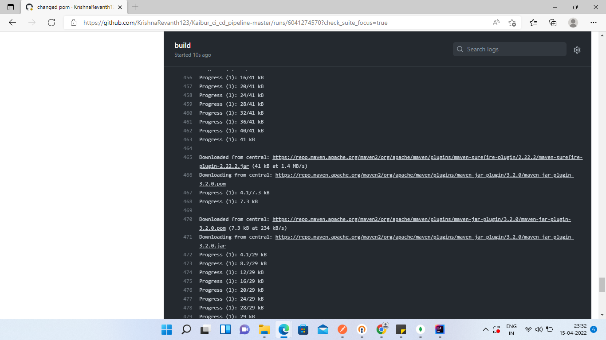
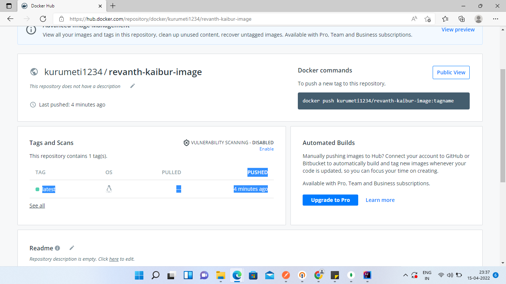
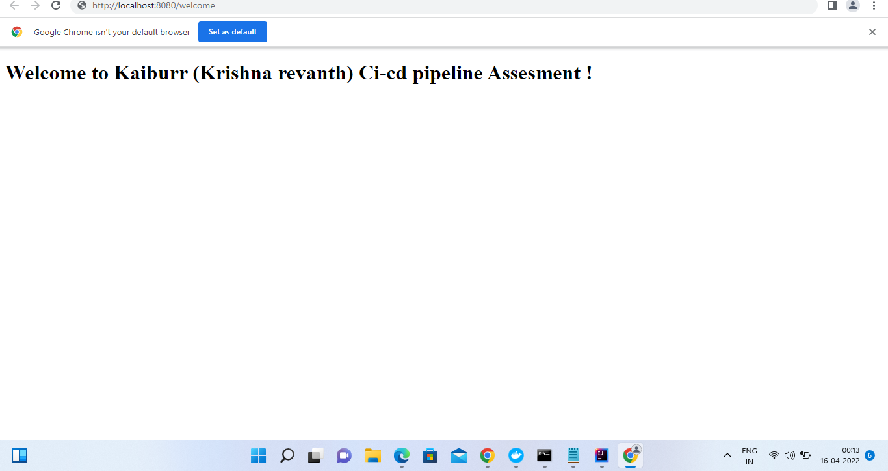

# ci-cd pipe line using github-actions-example

<b> Task 5 </b> 
I HAVE AUTOMATED THE PROCESS OF BUILD AND PUSH DOCKER IMAGE TO DOCKER HUB BY CREATING THE CI/CD PIPELINE USING GITHUB ACTIONS.  

<b>STEPS I HAVE DONE</b> 

<b>1)FIRST I CREATED A SIMPLE SPRING PROJECT WITH GET MAPPING THAT RETURNS A STRING </b> 
<b>2)I HAVE UPLOADED MY CODE TO GIT HUB </b> 
<b>3)I HAVE CREATED A WORK FLOW FROM GITHUB ACTION TAB TO PERFORM CONTINUOUS INTERATION AND CONTINOUS DEPLOYMENT</b> 
<b>4)AS PART OF THE WE CAN DO BUILDING AND TESTING ,BUILD DOCKER IMAGE,PUSH IMAGE TO DOCKER HUB. THEN GIT HUB ACTION WILL EXECUTE THESE.</b> 

<b>Screenshot</b> 
<b>1)MAIN PAGE</b> 
  

<b>2)CREATED REPO IN DOCKER HUB WITH JAR NAME AS YOU CAN SEE IN SCREEN SHOT </b> 
  

<b>3)ADDED SECRETS</b> 
  

<b>4)UPDATED SECRETS SUCCESSFULLY</b> 
  

<b>5)PUSHING COMMIT</b> 
  

<b>6)PUSHED COMMIT SUCCESSFULLY</b> 
  

<b>7)GETTING BUILD IN GITHUB ACTIONS</b> 
  
  
  
  
  
  
  

<b>8)SUCCESSFULLY PUSHED AS YOU CAN SEE IN DOCKERHUB </b> 
 

<b>9)SUCCESSFULLY CONTENT PULLED AS YOU CAN SEE I HAVE RUN THE APPLICATION </b> 
  
